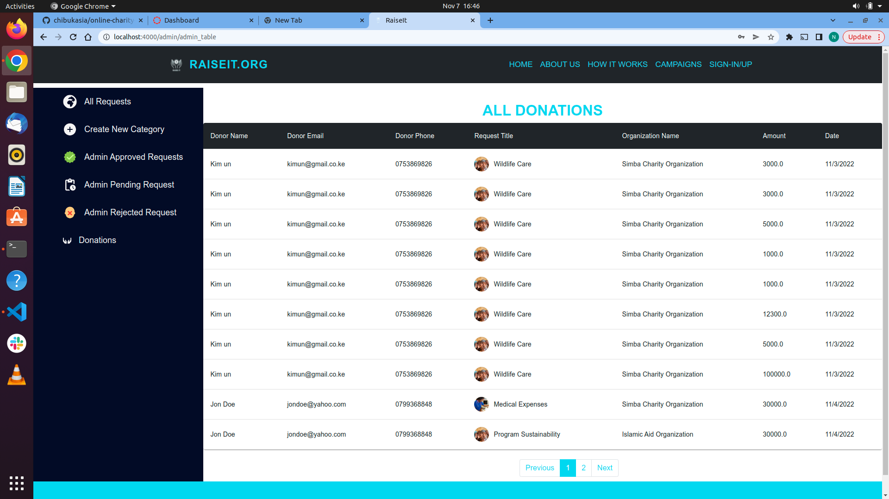

# RaiseIt Online Charity Management System

## Contirbutors

### Nelson Chibukasia
### Brian Munene
### Brian Ambundo
### Titus Kamunya
### Kevin Mbaka

## Description

We have come up with a professional website design that offers services to the charities and non-profit organizations in Kenya. Whether you have just started out or you run an established charity, RAISEIT - is a professional website design that helps charities and non-profit organizations develop an online presence and promote their business and services online to a wider audience of potential clients.We designed a fully functional charity website.Our web app has an admin, and users(whether an NGO or donor) that interact and make use of the page acording to their needs. An NGO can request to raise and fund its good cause through our web app and donors can support and fund the good causes through their donations and more through this web app.
We hope you enjoy using it and interacting with it as much as we enjoyed developing it. It is all in good faith and pride!!

## Set Up
### Prequisites 
You must have the following instlled
* Ruby 3.1.2
* Node js
* Rails Framework
### Project set up
* Run `bundle install` to install all the ruby dependencies
* Run `npm install` in the client directory to install node packages 
* Run `rails s` to start the server 
* Run `npm start` in the client directory to start the applications
## Screenshots
#### Home Page

#### How it works

#### Landing page fundraises preview

#### Login page

#### Sign Up Page 

#### NGO Dashboard

#### NGO Donations report

#### Donation Requestb Form

#### Admin Dashboard

#### Donation Request Details

#### Admin Donations Report

## Features 
* Home Page
* SignIn Page
* Donations Page
* NGO Page

## Technologies used
* HTML 5
* CSS 3
* JavaScript(React)
* Ruby on Rails
* Postgres
* Bootstrap

<!-- ## LIVE LINK TO WEB APP -->

## LICENSE
Copyright (c) 2022 RAISEIT

Permission is hereby granted, free of charge, to any person obtaining a copy of this software and associated documentation files (the "Software"), to deal in the Software without restriction, including without limitation the rights to use, copy, modify, merge, publish, distribute, sublicense, and/or sell copies of the Software, and to permit persons to whom the Software is furnished to do so, subject to the following conditions:

The above copyright notice and this permission notice shall be included in all copies or substantial portions of the Software.

THE SOFTWARE IS PROVIDED "AS IS", WITHOUT WARRANTY OF ANY KIND, EXPRESS OR IMPLIED, INCLUDING BUT NOT LIMITED TO THE WARRANTIES OF MERCHANTABILITY, FITNESS FOR A PARTICULAR PURPOSE AND NONINFRINGEMENT. IN NO EVENT SHALL THE AUTHORS OR COPYRIGHT HOLDERS BE LIABLE FOR ANY CLAIM, DAMAGES OR OTHER LIABILITY, WHETHER IN AN ACTION OF CONTRACT, TORT OR OTHERWISE, ARISING FROM, OUT OF OR IN CONNECTION WITH THE SOFTWARE OR THE USE OR OTHER DEALINGS IN THE SOFTWARE

